Code From Class
================

# Code from Population Structure

First, remember to create a week13 directory and copy the data

``` bash
mkdir -p week12ps
cd week12ps
cp /home/BIO594/DATA/Week8/* .
```

Let’s load two R packages that we will use for this analysis

``` r
library(adegenet)
```

    ## Loading required package: ade4

    ## 
    ##    /// adegenet 2.1.6 is loaded ////////////
    ## 
    ##    > overview: '?adegenet'
    ##    > tutorials/doc/questions: 'adegenetWeb()' 
    ##    > bug reports/feature requests: adegenetIssues()

``` r
library(vcfR)
```

    ## 
    ##    *****       ***   vcfR   ***       *****
    ##    This is vcfR 1.12.0 
    ##      browseVignettes('vcfR') # Documentation
    ##      citation('vcfR') # Citation
    ##    *****       *****      *****       *****

First, we can use the package VCFr to “read” our VCF file into R

``` r
my_vcf <- read.vcfR("./week12ps/SNPs.vcf")
```

    ## Scanning file to determine attributes.
    ## File attributes:
    ##   meta lines: 63
    ##   header_line: 64
    ##   variant count: 938
    ##   column count: 89
    ## Meta line 63 read in.
    ## All meta lines processed.
    ## gt matrix initialized.
    ## Character matrix gt created.
    ##   Character matrix gt rows: 938
    ##   Character matrix gt cols: 89
    ##   skip: 0
    ##   nrows: 938
    ##   row_num: 0
    ## Processed variant: 938
    ## All variants processed

We can then convert the VCF to a `genind` file which the package
`adegenet` can use for analyses

``` r
my_genind <- vcfR2genind(my_vcf)
```

We can add information like population, library, sample name, etc. with
strata (short for stratification). It’s a simple tab deliminted text
file:

``` bash
cat ./week12ps/strata
```

    ## Individual   Population  Library
    ## PopA_001 PopA    LibA
    ## PopA_002 PopA    LibA
    ## PopA_003 PopA    LibA
    ## PopA_004 PopA    LibA
    ## PopA_005 PopA    LibA
    ## PopA_006 PopA    LibA
    ## PopA_007 PopA    LibA
    ## PopA_008 PopA    LibA
    ## PopA_009 PopA    LibA
    ## PopA_010 PopA    LibA
    ## PopA_011 PopA    LibA
    ## PopA_012 PopA    LibA
    ## PopA_013 PopA    LibA
    ## PopA_014 PopA    LibA
    ## PopA_015 PopA    LibA
    ## PopA_016 PopA    LibA
    ## PopA_017 PopA    LibA
    ## PopA_018 PopA    LibA
    ## PopA_019 PopA    LibA
    ## PopA_020 PopA    LibA
    ## PopB_001 PopB    LibA
    ## PopB_002 PopB    LibA
    ## PopB_003 PopB    LibA
    ## PopB_004 PopB    LibA
    ## PopB_005 PopB    LibA
    ## PopB_006 PopB    LibA
    ## PopB_007 PopB    LibA
    ## PopB_008 PopB    LibA
    ## PopB_009 PopB    LibA
    ## PopB_010 PopB    LibA
    ## PopB_011 PopB    LibA
    ## PopB_012 PopB    LibA
    ## PopB_013 PopB    LibA
    ## PopB_014 PopB    LibA
    ## PopB_015 PopB    LibA
    ## PopB_016 PopB    LibA
    ## PopB_017 PopB    LibA
    ## PopB_018 PopB    LibA
    ## PopB_019 PopB    LibA
    ## PopB_020 PopB    LibA
    ## PopC_001 PopC    LibB
    ## PopC_002 PopC    LibB
    ## PopC_003 PopC    LibB
    ## PopC_004 PopC    LibB
    ## PopC_005 PopC    LibB
    ## PopC_006 PopC    LibB
    ## PopC_007 PopC    LibB
    ## PopC_008 PopC    LibB
    ## PopC_009 PopC    LibB
    ## PopC_010 PopC    LibB
    ## PopC_011 PopC    LibB
    ## PopC_012 PopC    LibB
    ## PopC_013 PopC    LibB
    ## PopC_014 PopC    LibB
    ## PopC_015 PopC    LibB
    ## PopC_016 PopC    LibB
    ## PopC_017 PopC    LibB
    ## PopC_018 PopC    LibB
    ## PopC_019 PopC    LibB
    ## PopC_020 PopC    LibB
    ## PopD_001 PopD    LibB
    ## PopD_002 PopD    LibB
    ## PopD_003 PopD    LibB
    ## PopD_004 PopD    LibB
    ## PopD_005 PopD    LibB
    ## PopD_006 PopD    LibB
    ## PopD_007 PopD    LibB
    ## PopD_008 PopD    LibB
    ## PopD_009 PopD    LibB
    ## PopD_010 PopD    LibB
    ## PopD_011 PopD    LibB
    ## PopD_012 PopD    LibB
    ## PopD_013 PopD    LibB
    ## PopD_014 PopD    LibB
    ## PopD_015 PopD    LibB
    ## PopD_016 PopD    LibB
    ## PopD_017 PopD    LibB
    ## PopD_018 PopD    LibB
    ## PopD_019 PopD    LibB
    ## PopD_020 PopD    LibB

``` r
strata<- read.table("./week12ps/strata", header=TRUE)
strata_df <- data.frame(strata)
strata(my_genind) <- strata_df
setPop(my_genind) <- ~Population
```

\#Test Population Structure

Let’s calculate *F<sub>ST</sub>*

## Pairwise Fst

First, we convert our genid format file to hierfstat format. Second
command calculates *F<sub>ST</sub>* values

``` r
library("hierfstat")
```

    ## 
    ## Attaching package: 'hierfstat'

    ## The following object is masked from 'package:adegenet':
    ## 
    ##     read.fstat

``` r
neutral_hstat <- genind2hierfstat(my_genind, pop = my_genind@pop)
neutral_hstat.mat <- pairwise.WCfst(neutral_hstat)
```

Next, we will conver the results to a nice pairwise matrix and then melt
the matrix for plotting in ggplot

``` r
library("reshape2")
neutral_hstat.matriN <- as.matrix(neutral_hstat.mat)
melted_neutral_hstat.matriN <- melt(neutral_hstat.matriN, na.rm =TRUE)
round(neutral_hstat.matriN,4)
```

    ##        PopA   PopB   PopC   PopD
    ## PopA     NA 0.0155 0.0443 0.1491
    ## PopB 0.0155     NA 0.0270 0.1334
    ## PopC 0.0443 0.0270     NA 0.1095
    ## PopD 0.1491 0.1334 0.1095     NA

``` r
summary(melted_neutral_hstat.matriN$value)
```

    ##    Min. 1st Qu.  Median    Mean 3rd Qu.    Max. 
    ## 0.01551 0.02703 0.07694 0.07981 0.13336 0.14908

``` r
library(ggplot2)
#Plotting Pairwise fst
neut_fst <- ggplot(data = melted_neutral_hstat.matriN, aes(Var2, Var1, fill = value))+ geom_tile(color = "white")+ 
  scale_fill_gradient(low = "white", high = "chocolate1", name="FST")  +
  ggtitle("Pairwise FST, WC (1984) Neutral SNPs", )+
  labs( x = "Sampling Site", y = "Sampling Site") + 
  theme(axis.text.x = element_text(angle = 45, vjust = 1, size = 12, hjust = 1),axis.text.y = element_text(size = 12)) + 
  theme(axis.title = element_text(size = 12),legend.text = element_text(size =14), legend.title = element_text(size =14)) +
  theme(plot.title = element_text(size = 14)) +
coord_fixed()
neut_fst
```

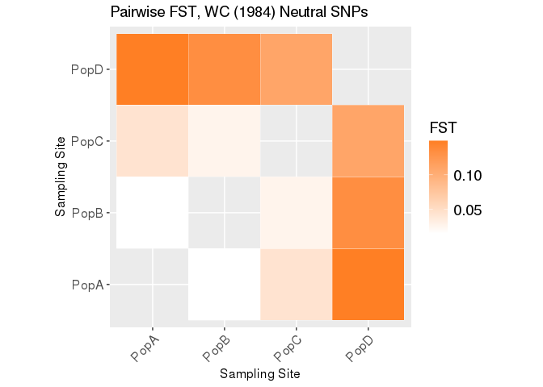<!-- -->

\#PCA We will use adegenet to calculate our PCA. See tutorials
[here](https://github.com/thibautjombart/adegenet/wiki/Tutorials).

You can use the command `pca1 <- dudi.pca(X, scale = FALSE)` to
interactively pick your PCs, but we cannot do that in RMarkdown, so will
will just pick the first three.

``` r
X <- tab(my_genind, freq = TRUE, NA.method = "mean")
pca1 <- dudi.pca(X, scale = FALSE, scannf = FALSE, nf = 3)
```

Let’s plot the PCA eigenvalues

``` r
barplot(pca1$eig[1:50], main = "PCA eigenvalues", col = heat.colors(50))
```

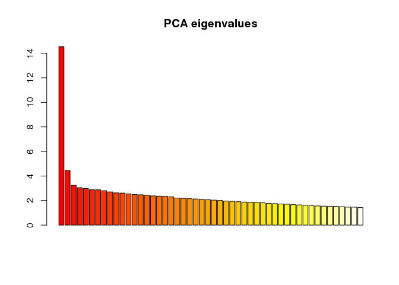<!-- -->

Now the PCA

``` r
s.class(pca1$li, pop(my_genind))
title("PCA of simulated dataset\naxes 1-2")
add.scatter.eig(pca1$eig[1:20], 3,1,2)
```

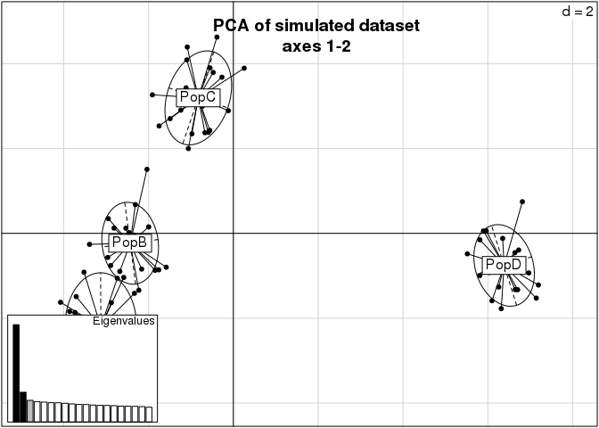<!-- -->

Ok, let’s make it look better

``` r
col <- funky(15)
s.class(pca1$li, pop(my_genind),xax=1,yax=2, col=col, axesell=FALSE, cstar=0, cpoint=3, grid=FALSE)
```

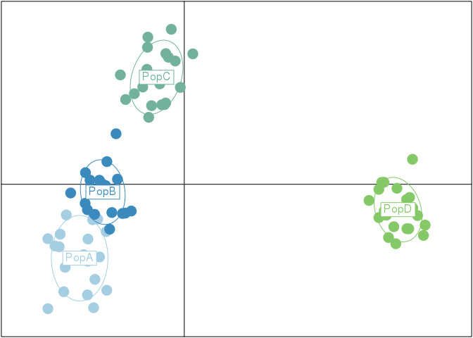<!-- -->

\#Missing Data

Too much missing data can make your PCA look wonky. Take a look at this
example:

Our original VCF had less than 1% missing data. Let’s look at one with
more. This is the same but now with 5% missing data.

``` r
my_vcf <- read.vcfR("./week12ps/SNP.missing.vcf")
```

    ## Scanning file to determine attributes.
    ## File attributes:
    ##   meta lines: 63
    ##   header_line: 64
    ##   variant count: 938
    ##   column count: 89
    ## Meta line 63 read in.
    ## All meta lines processed.
    ## gt matrix initialized.
    ## Character matrix gt created.
    ##   Character matrix gt rows: 938
    ##   Character matrix gt cols: 89
    ##   skip: 0
    ##   nrows: 938
    ##   row_num: 0
    ## Processed variant: 938
    ## All variants processed

``` r
my_genind <- vcfR2genind(my_vcf)
```

``` r
strata<- read.table("./week12ps/strata", header=TRUE)
strata_df <- data.frame(strata)
strata(my_genind) <- strata_df

setPop(my_genind) <- ~Population

X <- tab(my_genind, freq = TRUE, NA.method = "mean")
pca1 <- dudi.pca(X, scale = FALSE, scannf = FALSE, nf = 3)
s.class(pca1$li, pop(my_genind),xax=1,yax=2, col=col, axesell=FALSE, cstar=0, cpoint=3, grid=FALSE)
```

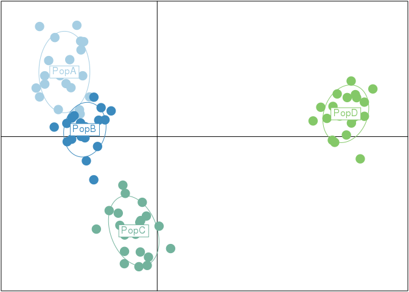<!-- -->

This vcf has 10% missing data

``` r
my_vcf <- read.vcfR("./week12ps/SNP.missing2.vcf")
```

    ## Scanning file to determine attributes.
    ## File attributes:
    ##   meta lines: 63
    ##   header_line: 64
    ##   variant count: 938
    ##   column count: 89
    ## Meta line 63 read in.
    ## All meta lines processed.
    ## gt matrix initialized.
    ## Character matrix gt created.
    ##   Character matrix gt rows: 938
    ##   Character matrix gt cols: 89
    ##   skip: 0
    ##   nrows: 938
    ##   row_num: 0
    ## Processed variant: 938
    ## All variants processed

``` r
my_genind <- vcfR2genind(my_vcf)


strata<- read.table("./week12ps/strata", header=TRUE)
strata_df <- data.frame(strata)
strata(my_genind) <- strata_df

setPop(my_genind) <- ~Population

X <- tab(my_genind, freq = TRUE, NA.method = "mean")
pca1 <- dudi.pca(X, scale = FALSE, scannf = FALSE, nf = 3)
s.class(pca1$li, pop(my_genind),xax=1,yax=2, col=col, axesell=FALSE, cstar=0, cpoint=3, grid=FALSE)
```

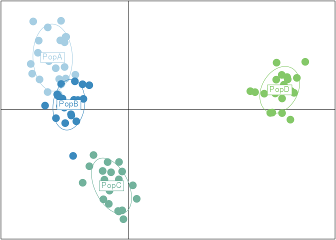<!-- -->
Notice how all individuals are moving towards the origin.

Let’s look at one with only missing data in one population “D”

``` r
my_vcf <- read.vcfR("./week12ps/SNP.missingPopD2.vcf")
```

    ## Scanning file to determine attributes.
    ## File attributes:
    ##   meta lines: 63
    ##   header_line: 64
    ##   variant count: 938
    ##   column count: 89
    ## Meta line 63 read in.
    ## All meta lines processed.
    ## gt matrix initialized.
    ## Character matrix gt created.
    ##   Character matrix gt rows: 938
    ##   Character matrix gt cols: 89
    ##   skip: 0
    ##   nrows: 938
    ##   row_num: 0
    ## Processed variant: 938
    ## All variants processed

``` r
my_genind <- vcfR2genind(my_vcf)


strata<- read.table("./week12ps/strata", header=TRUE)
strata_df <- data.frame(strata)
strata(my_genind) <- strata_df

setPop(my_genind) <- ~Population

X <- tab(my_genind, freq = TRUE, NA.method = "mean")
pca1 <- dudi.pca(X, scale = FALSE, scannf = FALSE, nf = 3)
s.class(pca1$li, pop(my_genind),xax=1,yax=2, col=col, axesell=FALSE, cstar=0, cpoint=3, grid=FALSE)
```

<!-- -->
See how several D indivials are now on the x axis.

# Related

Related individals can also skew PCA results

``` r
my_vcf <- read.vcfR("./week12ps/SNP.related.vcf")
```

    ## Scanning file to determine attributes.
    ## File attributes:
    ##   meta lines: 63
    ##   header_line: 64
    ##   variant count: 938
    ##   column count: 89
    ## Meta line 63 read in.
    ## All meta lines processed.
    ## gt matrix initialized.
    ## Character matrix gt created.
    ##   Character matrix gt rows: 938
    ##   Character matrix gt cols: 89
    ##   skip: 0
    ##   nrows: 938
    ##   row_num: 0
    ## Processed variant: 938
    ## All variants processed

``` r
my_genind <- vcfR2genind(my_vcf)


strata<- read.table("./week12ps/strata", header=TRUE)
strata_df <- data.frame(strata)
strata(my_genind) <- strata_df

setPop(my_genind) <- ~Population

X <- tab(my_genind, freq = TRUE, NA.method = "mean")
pca1 <- dudi.pca(X, scale = FALSE, scannf = FALSE, nf = 3)
s.class(pca1$li, pop(my_genind),xax=1,yax=2, col=col, axesell=FALSE, cstar=0, cpoint=3, grid=FALSE)
```

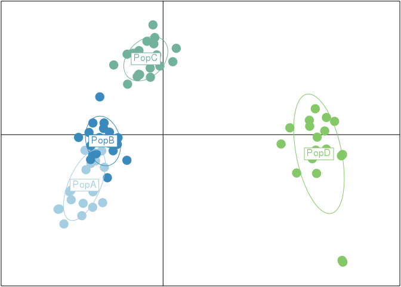<!-- -->
See how the two green “D” individuals are apart from everyone else but
close to each other

# Isolation by distance

``` r
my_vcf <- read.vcfR("./week12ps/SNPs.vcf")
```

    ## Scanning file to determine attributes.
    ## File attributes:
    ##   meta lines: 63
    ##   header_line: 64
    ##   variant count: 938
    ##   column count: 89
    ## Meta line 63 read in.
    ## All meta lines processed.
    ## gt matrix initialized.
    ## Character matrix gt created.
    ##   Character matrix gt rows: 938
    ##   Character matrix gt cols: 89
    ##   skip: 0
    ##   nrows: 938
    ##   row_num: 0
    ## Processed variant: 938
    ## All variants processed

``` r
my_genind <- vcfR2genind(my_vcf)


strata<- read.table("./week12ps/strata", header=TRUE)
strata_df <- data.frame(strata)
strata(my_genind) <- strata_df

setPop(my_genind) <- ~Population

xy <-read.table("./week12ps/dist.mat")
xy
```

    ##      x y
    ## PopA 0 1
    ## PopB 0 2
    ## PopC 1 2
    ## PopD 2 4

``` r
my_genind@other$xy <- xy


toto <- genind2genpop(my_genind)
```

    ## 
    ##  Converting data from a genind to a genpop object... 
    ## 
    ## ...done.

``` r
Dgeo <- dist(my_genind$other$xy)
Dgen <- dist.genpop(toto,method=2)
ibd <- mantel.randtest(Dgen,Dgeo)

plot(ibd)
```

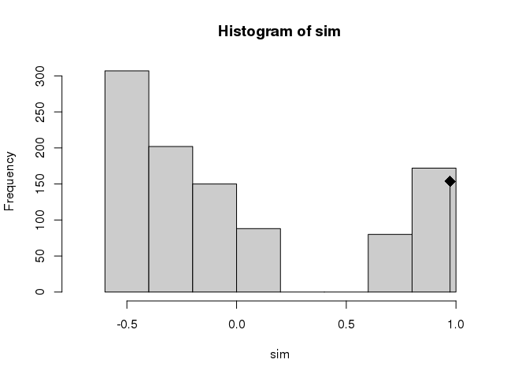<!-- -->

``` r
plot(Dgeo, Dgen)
abline(lm(Dgen~Dgeo), col="red",lty=2)
```

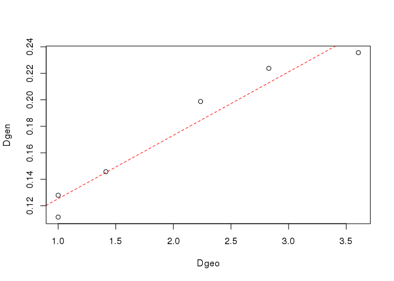<!-- -->

\#DAPC

First let’s estimate if there are any clusters:

This code is interactive and must be run in the r console
`grp <- find.clusters(my_genind, max.n.clust=40)`

Choose “80” first and then look for the elbow. Here it’s at “2”.

Now we can plot assignment

``` r
grp <- find.clusters(my_genind, max.n.clust=40,n.pca=80,n.clust=2)
table(pop(my_genind), grp$grp)
```

    ##       
    ##         1  2
    ##   PopA  0 20
    ##   PopB  0 20
    ##   PopC  0 20
    ##   PopD 20  0

``` r
table.value(table(pop(my_genind), grp$grp), col.lab=paste("inf", 1:2), row.lab=paste("ori", 1:4))
```

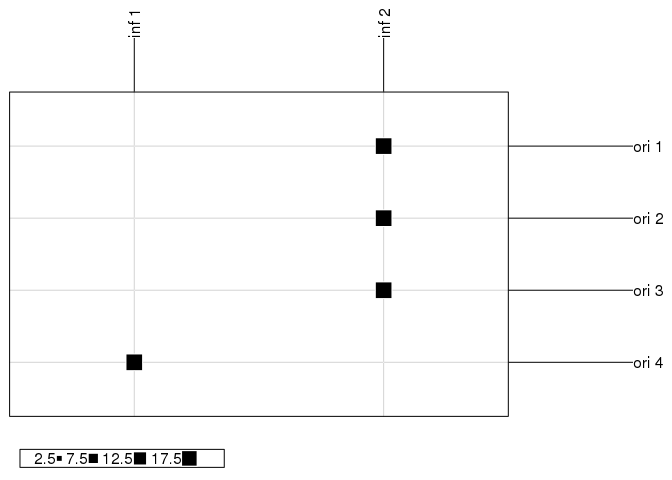<!-- -->
We can see that there are two inferred clusters. All individuals from
PopA, PopB, and PopC are in group 1 and PopD is in Group 2

We can run a DAPC on this using the inferred groups:

This code is also interactive: `dapc1 <- dapc(my_genind, grp$grp)`

This time we want to use as few as PCs as possbible, enough to capture
80& of the variance. We’ll use 60.

We have only two groups, so one discriminant function.

Let’s take a look:

``` r
dapc1 <- dapc(my_genind, grp$grp,n.pc=60, n.da = 1)
scatter(dapc1,col=col,bg="white", solid=1)
```

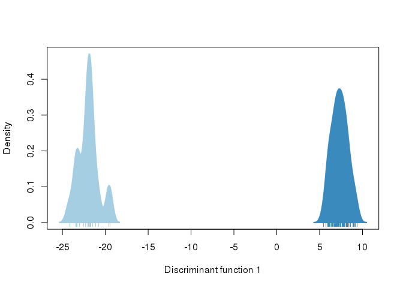<!-- -->

There’s only one function, but we can see what loci are driving this
pattern:

``` r
contrib <- loadingplot(dapc1$var.contr, axis=1, thres=.01, lab.jitter=1)
```

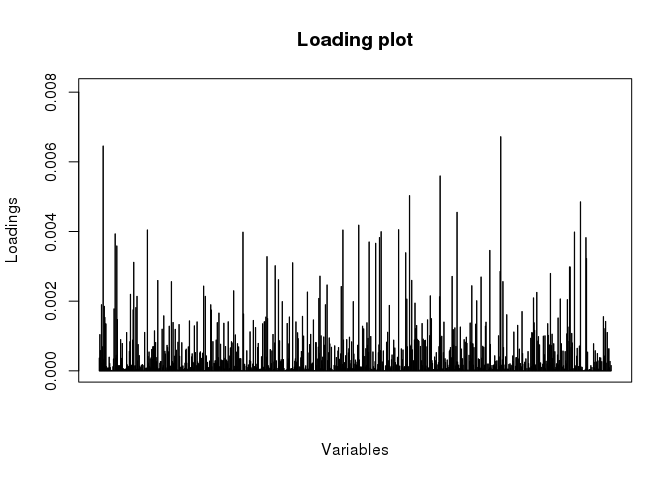<!-- -->
Looks like it’s quite a few scattered across the genome.

We can also use this technique to look for batch effects or library
effects. We have a Library parameter in our strata file. We can use
that.

``` r
setPop(my_genind) <- ~Library
dapc1 <- dapc(my_genind, pop(my_genind), n.pca=60, n.da=1)
```

Now we can look to see if there are any artifactual loci driving
differences between libraries or batches

``` r
contrib <- loadingplot(dapc1$var.contr, axis=1, thres=.05, lab.jitter=1)
```

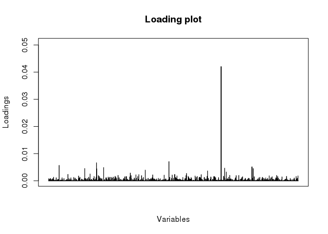<!-- -->

Oh no! Looks like there is a locus with a big batch effect. That’s
something we will need to filter out.

\#Structure Like We can also make STRUCTURE like plots using DAPC.

``` r
compoplot(dapc1, posi="bottomright",txt.leg=paste("Cluster", 1:2), lab="", ncol=1, xlab="individuals")
```

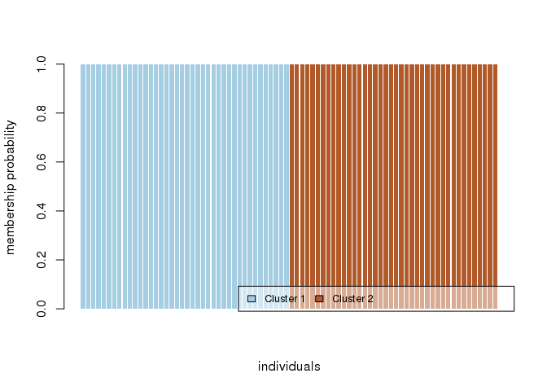<!-- -->

## How do I filter outlier loci out to create a neutral VCF file?

See code below “Combine all outlier loci into one file”
[here](https://github.com/amyzyck/RADseq_Uca-rapax_2016/blob/master/Scripts/OutlierDetection/OutlierDetection_UcaRapax.md#combine-all-outlier-loci-into-one-file)

Many different ways to do this though!!!
